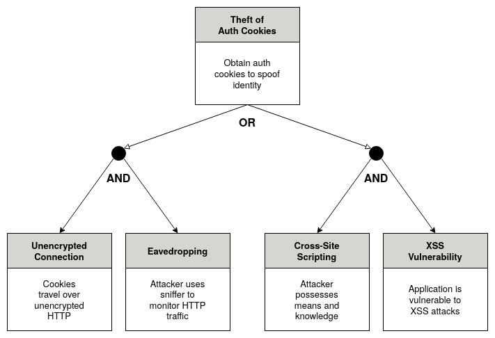

# Threat Tree Model

## 1. What is threat tree model?

The threat tree model is also called **attack tree model** because it analyzes how an effective attack happens.

Per [1]:

> Threat trees are a graphical representation of the elements that **must exist** for a threat to be realized. Threat trees present a threat in terms of a logical combination of elements, using ANDs and ORs to show the relationships between the required elements. This assists the development team, for if two elements are required, `A AND B`, then the blocking of either A or B will mitigate the threat.

The following example is a replica of [1]:

## References

- [1] [FUR-CSSLP] Chapter 4: Software Development Methodologies
